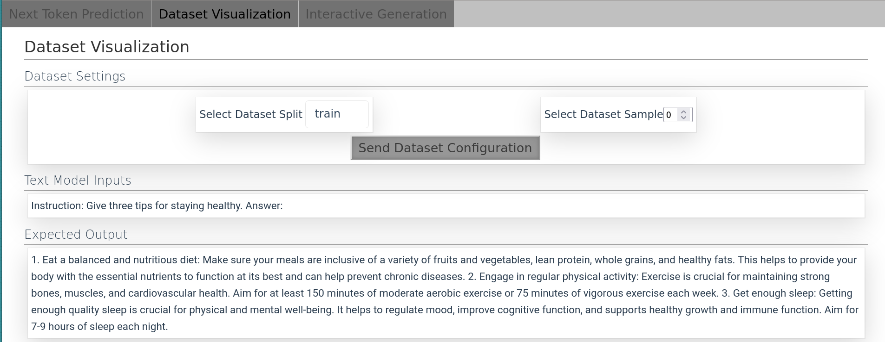
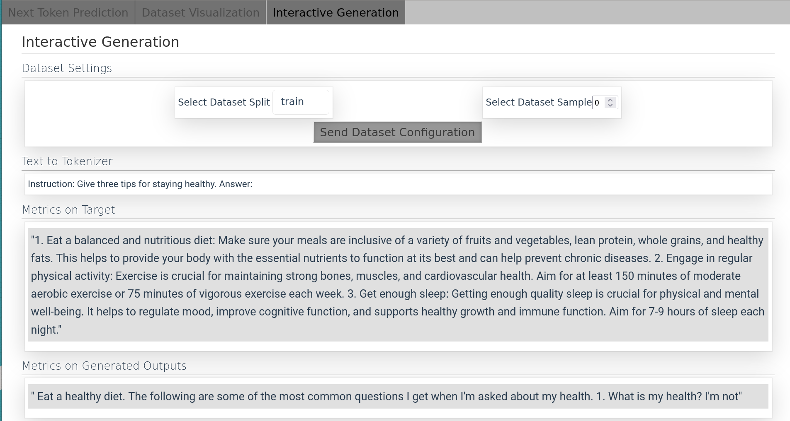
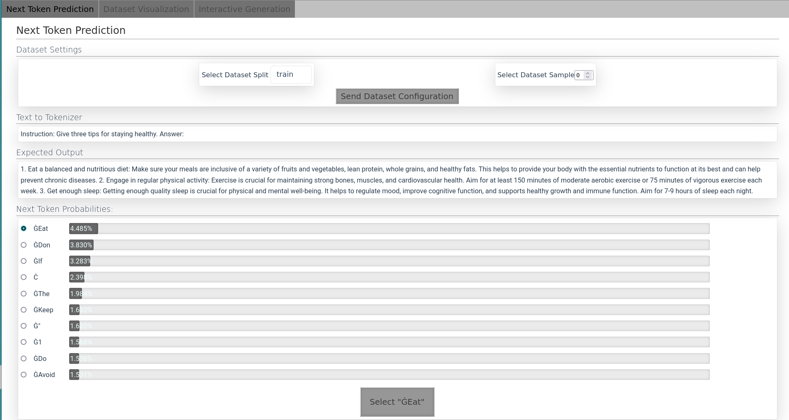
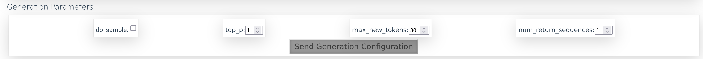
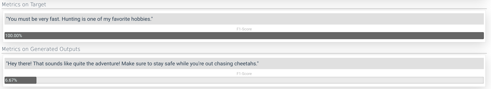
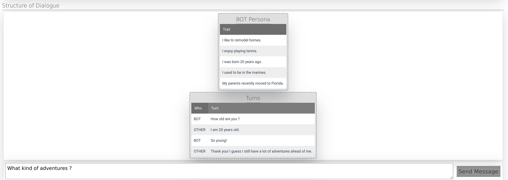

# Conditional Language Model Generation Visualization

- when evaluating language models it is often pain to see what is generated and why
- this little package is a `vue.js` frontend together with `flask` backend and it is designed to easily show some interesting visualizations on conditional generation models
- it handles frontend-backend communication as well as frontend rendering
- hence the developper can focus only on ML aspects of his work!


## VERSION: `0.4.4`

- added table modal, instead of creating a file that will be downloaded a `copy to clipboard` button was added

## changelog: `0.4.0`

- Text can be written with Bold and Italic Markdown (i.e. if you write `plain_text_element.content = "**text** ..."`, it will automatically be translated to `<b>text</b> ...`)
- Horizontal Multi Radio Element (multiple radios in horizontal row)
- if navbar overflows, it overflows to scroll
- on loading the collapsible expands which fixes bug


## Table of content

- [Installation](#installation)
- [Usage](#example-usage)
- Examples
  - [Alpaca Example](#alpaca-example)
  - [PersonaChat Example](#personachat-example)
  - [Documentation Links](#other-examples)
- [Acknowledgement](#acknowledgement)

## Installation

- install from pypi:
  - `pip install visuallm`

## Example Usage

### Alpaca Example

The first workflow that we'll show is the workflow where you don't alter the implementation of the components at all and just use the provided components.

#### Run Instructions

The alpaca example code can be found here: [`./examples_py/alpaca_example`](./examples_py/alpaca_example/), the code can be started by running `flask --app examples_py.alpaca_example.app run`.

We'll use `alpaca` dataset and `gpt2` model as those are reasonably small to run even on less performant computers.

<!-- MARKDOWN-AUTO-DOCS:START (CODE:src=./examples_py/alpaca_example/app.py&lines=14-19&header=# ./examples_py/alpaca_example/app.py lines 14-19)-->
<!-- The below code snippet is automatically added from ./examples_py/alpaca_example/app.py -->
```py
# ./examples_py/alpaca_example/app.py lines 14-19
def create_text_to_tokenizer(loaded_sample, target: str | None = None) -> str:
    text_to_tokenizer = f"Instruction: {loaded_sample['instruction']} Answer:"
    if target is not None:
        text_to_tokenizer += " " + target
```
<!-- MARKDOWN-AUTO-DOCS:END-->

All the datasets are different, therefore we expect the user to provide 3 functions, which
define how the text which is tokenized is constructed, how the text for the one step prediction
is constructed, and how the target text is constructed.

<!-- MARKDOWN-AUTO-DOCS:START (CODE:src=./examples_py/alpaca_example/app.py&lines=22-41&header=# ./examples_py/alpaca_example/app.py lines 22-41)-->
<!-- The below code snippet is automatically added from ./examples_py/alpaca_example/app.py -->
```py
# ./examples_py/alpaca_example/app.py lines 22-41
def create_text_to_tokenizer_one_step(loaded_sample, received_tokens: list[str]) -> str:
    # one step prediction means that the model is used to predict tokens one per one
    # received_tokens list contains already selected tokens

    text_to_tokenizer = (
        f"Instruction: {loaded_sample['instruction']} Answer:"
        + "".join(received_tokens)
    )
    return text_to_tokenizer


def retrieve_target_str(loaded_sample):
    return loaded_sample["output"]


generator = HuggingFaceGenerator(
    model=model,
    tokenizer=tokenizer,
    create_text_to_tokenizer=create_text_to_tokenizer,
```
<!-- MARKDOWN-AUTO-DOCS:END-->

Instantiate all the components from the library and run the server

<!-- MARKDOWN-AUTO-DOCS:START (CODE:src=./examples_py/alpaca_example/app.py&lines=44-57&header=# ./examples_py/alpaca_example/app.py lines 44-57)-->
<!-- The below code snippet is automatically added from ./examples_py/alpaca_example/app.py -->
```py
# ./examples_py/alpaca_example/app.py lines 44-57
)

app = create_app(dataset=dataset, generator_choices={"gpt2": generator})
```
<!-- MARKDOWN-AUTO-DOCS:END-->

#### Dataset Visualization (Screenshots)

In the screenshot, you can see that the dataset browser is created, where you can select dataset sample and dataset split and the frontend will show the inputs to the model and also the expected output.



#### Generation (Screenshots)

In the screenshot, you can see the dataset browser and the model generations.



#### Next Token Prediction (Screenshots)

In the screenshot, you can see that the library enables you to go through the generation step by step and explore why the generated sample (which can be seen e.g. on the Generation tab) looks the way it looks, how the distribution is skewed, etc.



### PersonaChat Example

The second workflow that we'll show is the workflow where you alter the implementation of the components, so that the dataset sample is shown in a different way.

If you want to use the app with the personachat dataset, you can play with prepared example by running: `flask --app examples_py.persona_chat_example.app run`.

The code for the sample can be found here: [`./examples_py/persona_chat_example`](./examples_py/persona_chat_example/).

#### Customization

The personachat dataset contains two pieces of information for each dataset sample.

1. The bot's persona
2. The past dialogue history

So we will add a `TableElement` which will display the two tables, one with bot's persona and one with past dialogue history. Since the visualization code is the same for all the components we will extract it into a separate class.

<!-- MARKDOWN-AUTO-DOCS:START (CODE:src=./examples_py/persona_chat_example/components/input_display.py&lines=9-55&header=# ./examples_py/persona_chat_example/components/input_display.py lines 9-55)-->
<!-- The below code snippet is automatically added from ./examples_py/persona_chat_example/components/input_display.py -->
```py
# ./examples_py/persona_chat_example/components/input_display.py lines 9-55
class PersonaChatVisualization:
    def __init__(self) -> None:
        # just for the typechecker to not complain
        self.loaded_sample: Any = 1

    def init_dialogue_vis_elements(self) -> list[ElementBase]:
        """Init elements which display the personachat tables."""
        table_input_heading = HeadingElement(content="Structure of Dialogue")
        self.input_table_vis = TableElement()
        return [table_input_heading, self.input_table_vis]

    def update_dialogue_structure_display(self, add_target: bool = True):
        """Update elements which display the personachat tables."""
        sample = self.loaded_sample
        context = copy.deepcopy(sample["history"])
        if add_target:
            context.append(sample["candidates"][-1])
        persona = sample["personality"]

        self.set_sample_tables_element(persona, context)

    def set_sample_tables_element(
        self, persona: list[str], context: list[str], other_last: bool = False
    ):
        """Populate the tables with the information from the dataset sample."""
        self.input_table_vis.clear()

        self.input_table_vis.add_table(
            title="BOT Persona",
            headers=["Trait"],
            rows=[[t] for t in persona],
        )

        d_len = len(context)  # dialogue length
        bot_on_odd = int(d_len % 2 == (1 if not other_last else 0))
        whos = ["BOT" if i % 2 == bot_on_odd else "OTHER" for i in range(d_len)]

        if len(context) > 0:
            self.input_table_vis.add_table(
                "Turns",
                ["Who", "Turn"],
                [[w, u] for w, u in zip(whos, context, strict=True)],
            )
```
<!-- MARKDOWN-AUTO-DOCS:END-->

Afterwards we need to implement the inheritors of components that should make use of this specific visualization of the dataset sample. Here is an example of the `Generation` component.

<!-- MARKDOWN-AUTO-DOCS:START (CODE:src=./examples_py/persona_chat_example/components/generation.py&lines=1-23&header=# ./examples_py/persona_chat_example/components/generation.py lines 1-23)-->
<!-- The below code snippet is automatically added from ./examples_py/persona_chat_example/components/generation.py -->
```py
# ./examples_py/persona_chat_example/components/generation.py lines 1-23
from visuallm.components import GenerationComponent
from visuallm.elements.element_base import ElementBase

from .input_display import PersonaChatVisualization


class Generation(GenerationComponent, PersonaChatVisualization):
    def __post_init__(self, *args, **kwargs):
        self.after_on_generator_change_callback()

    def init_model_input_display(self) -> list[ElementBase]:
        return [
            *PersonaChatVisualization.init_dialogue_vis_elements(self),
            *super().init_model_input_display(),
        ]

    def update_model_input_display(self):
        super().update_model_input_display()
        PersonaChatVisualization.update_dialogue_structure_display(
            self, add_target=False
        )
```
<!-- MARKDOWN-AUTO-DOCS:END-->

#### Generation Playground

Select which parameters you want to use for generation, plug in a `HuggingFace` model, or an `OpenAI` token and have fun with experimenting with various generation hyperparameters!




#### Chat Playground

Select which parameters you want to use for generation, plug in a `HuggingFace` model, or an `OpenAI` token and have fun with chatting with the model!



#### Visualize Next Token Predictions

By using `visuallm.components.NextTokenPredictionComponent.NextTokenPredictionComponent` you can just plug the HuggingFace model in and go through the generation process step by step.


### Other Examples

There is some other documentation:

1. How does the communication and bootstrapping of the components work ? ([link](./docs/Communication.md))
2. What is a minimal app that can be constructed ? ([link](./examples_py/simple_app/README.md))
3. How do the elements work, how can I create custom components ? ([link](./examples_py/example_modules/README.md))

## Acknowledgement
- this work was published on the INLG 2023 conference as a demo paper (link will be added later)
- Supported by the project TL05000236 AI asistent pro žáky a učitele co-financed by the Technological Agency of the Czech Republic and
by the ERC (No. 101039303 NG-NLG). Resources provided by the LINDAT/CLARIAH-CZ Research Infrastructure
