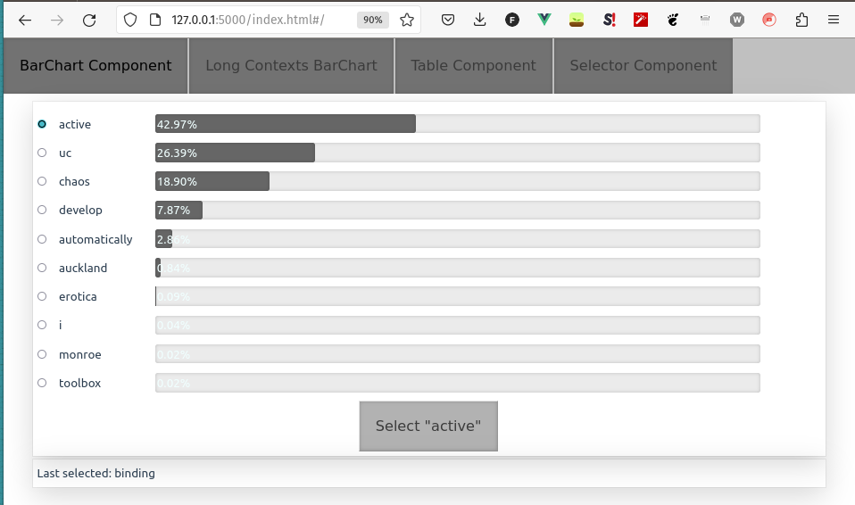
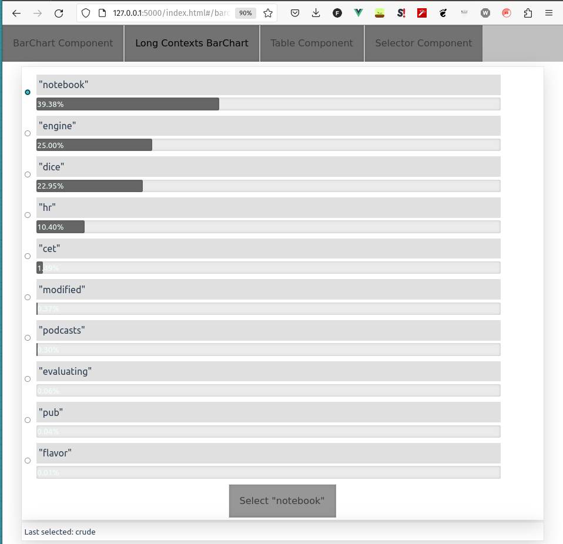
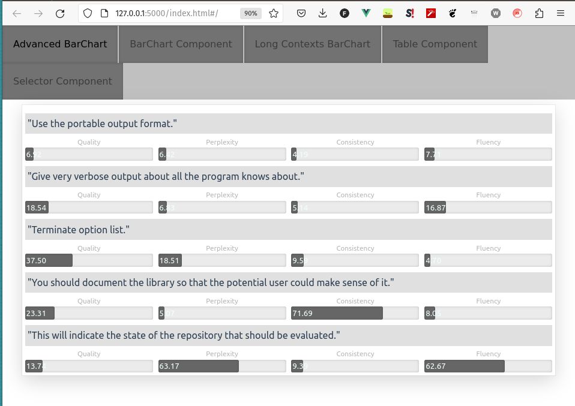

# Conditional Language Model Generation Visualization

## VERSION: `0.0.10`

- when evaluating language models it is often pain to see what is generated and why
- this little package is a `vue.js` frontend together with `flask` backend and it is designed to easily show some interesting visualizations on conditional generation models
- it handles frontend-backend communication as well as frontend rendering
- hence the developper can focus only on ML aspects of his work!

## Installation

- install from pypi:
  - `pip install llm-generation-server`
- install directly from git:
  - `pip install git+https://github.com/gortibaldik/visualize_llm_generation#egg=llm_generation_server`

## Usage

The library is composed of three parts:

1. Server - `llm_generation_server.server.Server`
2. Component - `llm_generation_server.component_base.ComponentBase`
3. Elements - `llm_generation_server.elements.*`

### Expected Workflow

1. Create a class inheriting from `llm_generation_server.component_base.ComponentBase`. In `__init__` you should:

- create all the elements from which the page should be composed

<!-- MARKDOWN-AUTO-DOCS:START (CODE:src=./examples_py/simple_component.py&lines=1-15&header=# ./examples_py/simple_component.py lines 1-15)-->
<!-- The below code snippet is automatically added from ./examples_py/simple_component.py -->
```py
# ./examples_py/simple_component.py lines 1-15
from llm_generation_server.component_base import ComponentBase
from llm_generation_server.elements.plain_text_element import PlainTextElement


class SimpleComponent(ComponentBase):
    def __init__(self):
        self.main_heading_element = PlainTextElement(
            is_heading=True, heading_level=2, content="Really Easy Component"
        )
        self.text_element = PlainTextElement(
            content="""
                Some really interesting text that isn't formatted in any way, it is
                just a plain simple text
            """
        )
```
<!-- MARKDOWN-AUTO-DOCS:END-->

- call `super().__init__`, where you specify name and title of the component as well as the created elements in the order that they should appear in the page

<!-- MARKDOWN-AUTO-DOCS:START (CODE:src=./examples_py/simple_component.py&lines=16-21&header=# ./examples_py/simple_component.py lines 16-21)-->
<!-- The below code snippet is automatically added from ./examples_py/simple_component.py -->
```py
# ./examples_py/simple_component.py lines 16-21
        super().__init__(
            name="simple_component",
            title="Simple Component",
            elements=[self.main_heading_element, self.text_element],
        )
```
<!-- MARKDOWN-AUTO-DOCS:END-->

2. Initialize `llm_generation_server.server.Server` and pass in the initialized components

<!-- MARKDOWN-AUTO-DOCS:START (CODE:src=./examples_py/simple_app.py&lines=1-7&header=# ./examples_py/simple_app.py)-->
<!-- The below code snippet is automatically added from ./examples_py/simple_app.py -->
```py
# ./examples_py/simple_app.py
from llm_generation_server.server import Server

from .simple_component import SimpleComponent

server = Server(__name__, [SimpleComponent()])
app = server.app
```
<!-- MARKDOWN-AUTO-DOCS:END-->

3. Standard method to run the flask application, e.g. for the example provided above, it would be

```sh
python3 -m flask --app examples_py.simple_app run
```


### Implemented Elements

I wrote this library to help me visualize the output distributions of various models I implemented during my master's thesis. Therefore I implemented only few basic elements for ML purposes.

#### Configuration Selection

Several different kinds of configuration specifier, together with one button element. The button element allows backend communication and by itself it does nothing. However you can specify subelements, for which the button element will provide communication updates. For the example below, the following imports will be used:

<!-- MARKDOWN-AUTO-DOCS:START (CODE:src=./examples_py/selector_component.py&lines=1-8&header=# ./examples_py/selector_component.py lines 1-8)-->
<!-- The below code snippet is automatically added from ./examples_py/selector_component.py -->
```py
# ./examples_py/selector_component.py lines 1-8
from llm_generation_server.component_base import ComponentBase
from llm_generation_server.elements.plain_text_element import PlainTextElement
from llm_generation_server.elements.selector_elements import (
    ButtonElement,
    CheckBoxSubElement,
    ChoicesSubElement,
    MinMaxSubElement,
)
```
<!-- MARKDOWN-AUTO-DOCS:END-->

##### MinMax SubElement

Input element for setting integer in a range.

<!-- MARKDOWN-AUTO-DOCS:START (CODE:src=./examples_py/selector_component.py&lines=11-16&header=# ./examples_py/selector_component.py lines 11-16)-->
<!-- The below code snippet is automatically added from ./examples_py/selector_component.py -->
```py
# ./examples_py/selector_component.py lines 11-16
class SelectorComponent(ComponentBase):
    def __init__(self):
        self.text_element = PlainTextElement(content="Nothing was selected")
        self.number_selector_element = MinMaxSubElement(
            sample_min=0, sample_max=10, text="Select Number:"
        )
```
<!-- MARKDOWN-AUTO-DOCS:END-->

##### Choices SubElement

Input element for choosing between several choices.

<!-- MARKDOWN-AUTO-DOCS:START (CODE:src=./examples_py/selector_component.py&lines=17-19&header=# ./examples_py/selector_component.py lines 17-19)-->
<!-- The below code snippet is automatically added from ./examples_py/selector_component.py -->
```py
# ./examples_py/selector_component.py lines 17-19
        self.choices_element = ChoicesSubElement(
            choices=["super", "magnificent", "incredible"], text="This library is:"
        )
```
<!-- MARKDOWN-AUTO-DOCS:END-->

##### Checkbox SubElement

Simple checkbox input element.

<!-- MARKDOWN-AUTO-DOCS:START (CODE:src=./examples_py/selector_component.py&lines=20-20&header=# ./examples_py/selector_component.py lines 20)-->
<!-- The below code snippet is automatically added from ./examples_py/selector_component.py -->
```py
# ./examples_py/selector_component.py lines 20
        self.checkbox_element = CheckBoxSubElement(text="Have you slept?:")
```
<!-- MARKDOWN-AUTO-DOCS:END-->

##### Button Element

This is an element that should encapsulate all the other configuration selection elements. It needs a callback method that will be called when the button is pressed and we provide `ButtonElement.default_select_callback()` which handles processing all the changes sent from the frontend and attributing them to `subelement.selected` properties of subelements.

<!-- MARKDOWN-AUTO-DOCS:START (CODE:src=./examples_py/selector_component.py&lines=21-50&header=# ./examples_py/selector_component.py lines 21-50)-->
<!-- The below code snippet is automatically added from ./examples_py/selector_component.py -->
```py
# ./examples_py/selector_component.py lines 21-50
        self.button_element = ButtonElement(
            subelements=[
                self.number_selector_element,
                self.choices_element,
                self.checkbox_element,
            ],
            endpoint_callback=self.button_clicked,
        )
        super().__init__(
            name="selector_component",
            title="Selector Component",
            elements=[
                PlainTextElement(
                    is_heading=True, heading_level=2, content="Selector Component"
                ),
                self.button_element,
                self.text_element,
            ],
        )

    def button_clicked(self):
        self.button_element.default_select_callback()
        n = self.number_selector_element.selected
        c = self.choices_element.selected
        b = self.checkbox_element.selected
        self.text_element.content = (
            f"This library is {c} and I would give "
            + f"it {n} stars out of {n} if I could. ({b})"
        )
        return self.fetch_info(fetch_all=False)
```
<!-- MARKDOWN-AUTO-DOCS:END-->

###### Show-Case

You can see the generated page by running the following script after cloning the github repository and navigating into it:

```sh
flask --app examples_py.app run
```

You can also see that there are several tabs at the top of the page, each tab refers to one `ComponentBase` implementation registered on the `Server` instance.

<!-- MARKDOWN-AUTO-DOCS:START (CODE:src=./examples_py/app.py&header=# ./examples_py/app.py)-->
<!-- The below code snippet is automatically added from ./examples_py/app.py -->
```py
# ./examples_py/app.py
from llm_generation_server.server import Server

from .bar_chart_component_simple import BarChartComponentSimple
from .selector_component import SelectorComponent
from .table_component import TableComponent

flask_app = Server(
    __name__,
    [
        BarChartComponentSimple(),
        BarChartComponentSimple(long_contexts=True, title="Long Contexts BarChart"),
        TableComponent(),
        SelectorComponent(),
    ],
)
app = flask_app.app
```
<!-- MARKDOWN-AUTO-DOCS:END-->


#### Table Element

This element can show several tables on the frontend together with a special feature, links between rows of the tables. They may connect different rows of different tables and display some value above links.

<!-- MARKDOWN-AUTO-DOCS:START (CODE:src=./examples_py/table_component.py&header=# ./examples_py/table_component.py)-->
<!-- The below code snippet is automatically added from ./examples_py/table_component.py -->
```py
# ./examples_py/table_component.py
from llm_generation_server.component_base import ComponentBase
from llm_generation_server.elements.plain_text_element import PlainTextElement
from llm_generation_server.elements.table_element import TableElement


class TableComponent(ComponentBase):
    def __init__(self):
        self._initialize_table_component()
        super().__init__(
            name="table_component",
            title="Table Component",
            elements=[
                PlainTextElement(
                    is_heading=True, heading_level=2, content="Table Component"
                ),
                self.table_element,
            ],
        )

    def _initialize_table_component(self):
        """Create a simple table with links pointing to all the rows upwards"""
        self.table_element = TableElement()

        # create a table with headers
        headers = ["No.", "Turn"]
        rows = [
            [i, x]
            for i, x in enumerate(
                [
                    "This is first row",
                    "This is second row",
                    "This is third row",
                    "This is fourth row",
                    "This is fifth row",
                ]
            )
        ]
        self.table_element.clear()
        TABLE_NAME = "Table1 is a Great Table"
        self.table_element.add_table(TABLE_NAME, headers, rows)

        # add links pointing to all the rows upwards
        for j in range(len(rows) - 1, 0, -1):
            for i in range(j):
                self.table_element.add_link_between_rows(
                    TABLE_NAME, j, TABLE_NAME, i, 3, "some value"
                )
```
<!-- MARKDOWN-AUTO-DOCS:END-->


#### BarChart Element

This element displays a modular horizontal barchart. It has several configuration options, so I'll try to show-case several of them.

The default bar-chart displays a horizontal selectable bar-chart. It is useful for displaying softmax distributions for the next token prediction. I implemented it in such a way that it is selectable, hence you can navigate the whole process of sequence generation in the same way as the automatic generation would do. Hence this component also implements frontend-backend communication and you can supply an `endpoint_callback` to it.

<!-- MARKDOWN-AUTO-DOCS:START (CODE:src=./examples_py/bar_chart_component_simple.py&lines=1-49&header=# ./examples_py/bar_chart_component_simple.py lines 1-49)-->
<!-- The below code snippet is automatically added from ./examples_py/bar_chart_component_simple.py -->
```py
# ./examples_py/bar_chart_component_simple.py lines 1-49
import heapq
import math
import random

import requests

from llm_generation_server.component_base import ComponentBase
from llm_generation_server.elements.barchart_element import BarChartElement
from llm_generation_server.elements.plain_text_element import PlainTextElement


class BarChartComponentSimple(ComponentBase):
    def __init__(self, long_contexts: bool = False, title="BarChart Component"):
        self.word_vocab, self.word_ids = download_word_vocabulary()
        self.barchart_element = BarChartElement(
            endpoint_callback=self.barchart_callback, long_contexts=long_contexts
        )
        self.text_element = PlainTextElement()
        self.update_barchart_component()

        super().__init__(
            name="barchart_component",
            title=title,
            elements=[self.barchart_element, self.text_element],
        )

    def update_barchart_component(self):
        probs = sample_ten_words(self.word_ids)
        ten_largest_probs = heapq.nlargest(10, zip(*zip(*probs), self.word_vocab))

        # bar height is the height of the bar, should be between 0 and 100
        bar_heights = [[x[0]] for x in ten_largest_probs]

        # bar annotation is the text displayed within the bar
        bar_annotations = [[f"{x[0]:.2f}%"] for x in ten_largest_probs]

        # annotation is the name of whole bar sub element
        annotations = [x[-1] for x in ten_largest_probs]

        self.barchart_element.set_possibilities(
            bar_heights, bar_annotations, annotations
        )

    def barchart_callback(self):
        self.barchart_element.default_callback(return_response=False)
        s: str = self.barchart_element.selected
        self.text_element.content = f"Last selected: {s}"
        self.update_barchart_component()
        return self.fetch_info(fetch_all=False)
```
<!-- MARKDOWN-AUTO-DOCS:END-->



When you set `long_contexts` option to true, the bar charts will be below the bar titles.



#### BarChart Element (Advanced)

This example will display the advanced possibilities I use when e.g. comparing different generation candidates provided by the model.

When I want to compare several candidates, I can display multi-bar-chart, e.g. add multiple bars with different heights, different annotations, each describing one particular quality of the generated sample.

<!-- MARKDOWN-AUTO-DOCS:START (CODE:src=./examples_py/bar_chart_component_advanced.py&lines=1-47&header=# ./examples_py/bar_chart_component_advanced.py lines 1-47)-->
<!-- MARKDOWN-AUTO-DOCS:END-->


