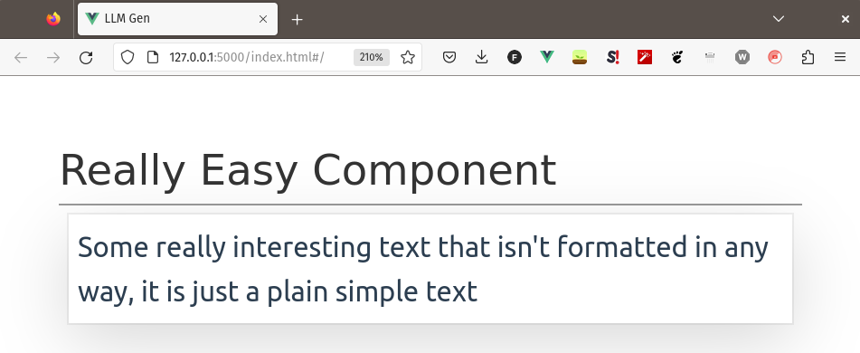
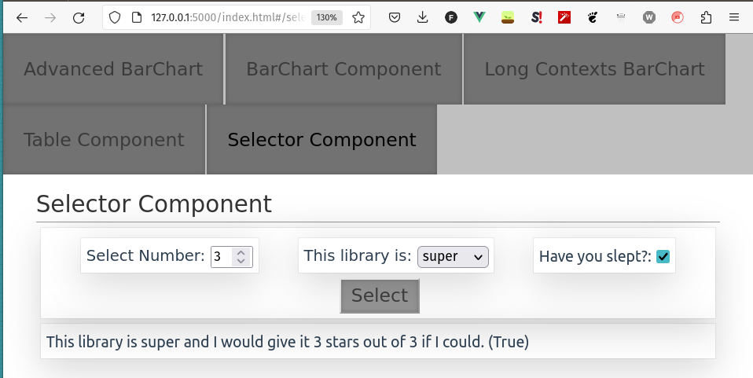
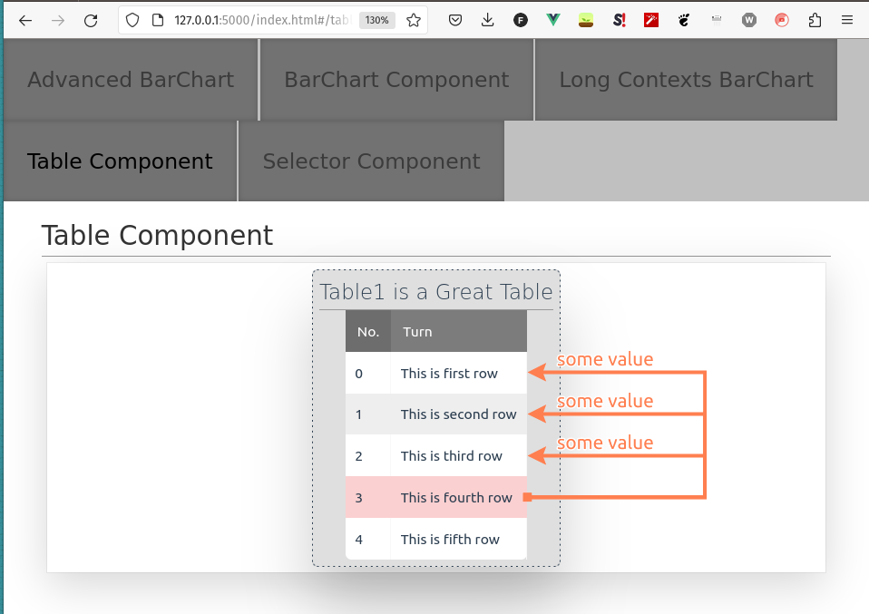
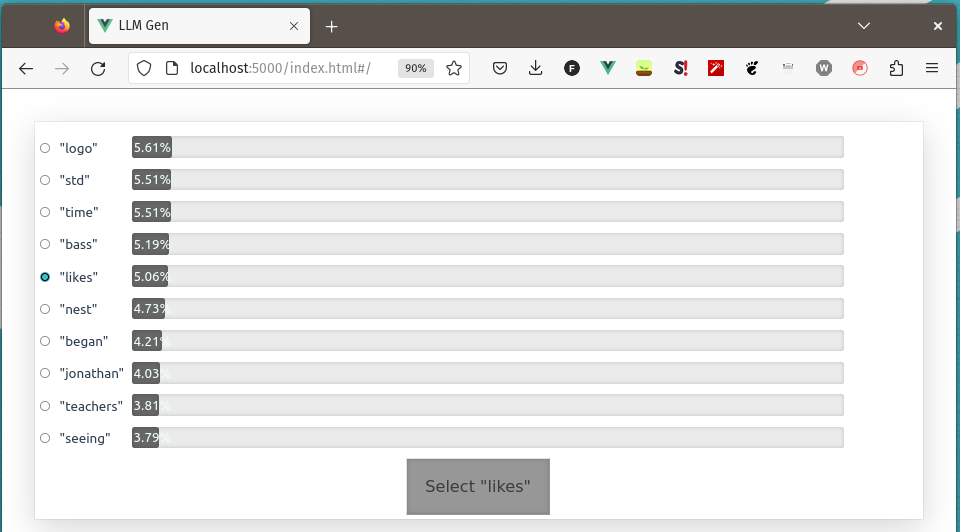
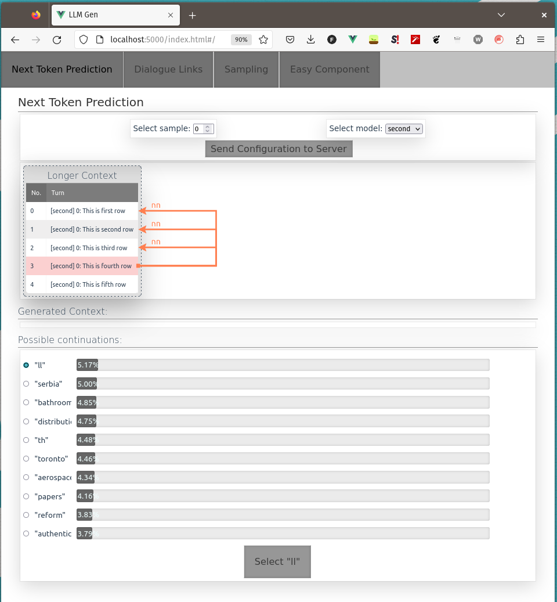
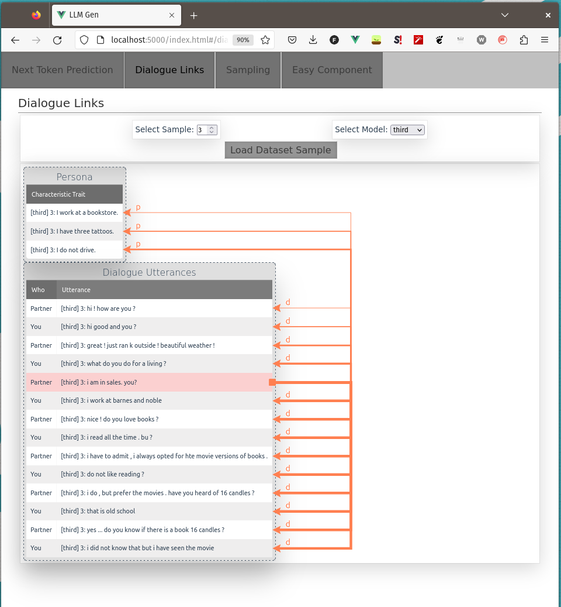

# Conditional Language Model Generation Visualization

## VERSION: `0.0.9`

- when evaluating language models it is often pain to see what is generated and why
- this little package is a `vue.js` frontend together with `flask` backend and it is designed to easily show some interesting visualizations on conditional generation models
- it handles frontend-backend communication as well as frontend rendering
- hence the developper can focus only on ML aspects of his work!

## Installation

- install from pypi:
  - `pip install llm-generation-server`
- install directly from git:
  - `pip install git+https://github.com/gortibaldik/visualize_llm_generation#egg=llm_generation_server`

## Usage

The library is composed of three parts:

1. Server - `llm_generation_server.server.Server`
2. Component - `llm_generation_server.component_base.ComponentBase`
3. Elements - `llm_generation_server.elements.*`

### Expected Workflow

1. Create a class inheriting from `llm_generation_server.component_base.ComponentBase`. In `__init__` you should:

- create all the elements from which the page should be composed

```python
# really_simple_component_example.py
class ReallyEasyComponent(ComponentBase):
    def __init__(self):
        self.main_heading_element = PlainTextElement(
            is_heading=True, heading_level=2, content="Really Easy Component"
        )
        self.text_element = PlainTextElement(
            content="""
                Some really interesting text that isn't formatted in any way, it is
                just a plain simple text
            """
        )
```

- call `super().__init__`, where you specify name and title of the component as well as the created elements in the order that they should appear in the page

```python
        super().__init__(
            name="really_easy_component",
            title="Easy Component",
            elements=[self.main_heading_element, self.text_element],
        )
```

2. Initialize `llm_generation_server.server.Server` and pass in the initialized components

```python
# app.py
from llm_generation_server.server import Server
from really_easy_component_example import ReallyEasyComponent

really_easy_component = ReallyEasyComponent()
flask_app = Server(__name__, [really_easy_component])
app = flask_app.app
```

3. `flask run`
   

### Implemented Elements

I wrote this library to help me visualize the output distributions of various models I implemented during my master's thesis. Therefore I implemented only few basic elements for ML purposes.

#### Selector Element

Input html elements with checks. This element is composed of multiple sub-parts. The design is chosen in such a way that it is possible to configure multiple values on the frontend with just one "send to backend" button.

##### MinMax SubElement

Input element for setting integer in a range. `text` is a text appearing to the right of the input element. The currently selected value can be accessed as `instance.selected`.

```python
from llm_generation_server.elements.selector_element import MinMaxSubElement

self.sample_selector_element = MinMaxSubElement(
    text="Select sample:",
    sample_min=0,
    sample_max=10,
)
```

##### Choices SubElement

Input element for choosing between a range of choices. `text` is a text appearing to the right of the input element. The currently selected value can be accessed as `instance.selected`.

```python
from llm_generation_server.elements.selector_element import ChoicesSubElement

self.model_selector = ChoicesSubElement(
    text="Select model:", choices=["first", "second", "third"]
)
```

##### Main Element

This element needs also a callback method, that will be called when frontend sends data. The implementation provides method `SelectorElement.default_select_callback()` which loads all the data from the request from frontend to the `instance.selected` of all its subelements.

```python
from llm_generation_server.elements.selector_element import SelectorElement

self.selector_element = SelectorElement(
    button_text="Send Configuration to Server",
    endpoint_callback=self.select_sample,
    subelements=[self.sample_selector_element, self.model_selector],
)

def select_sample(self):
    self.selector_element.default_select_callback()
    ...
```



#### Table Element

This element can show several tables on the frontend together with a special feature, links between rows of the tables. They may connect different rows of different tables and display some value above links.

```python
from llm_generation_server.elements.table_element import TableElement

self.table_element = TableElement()
headers = ["No.", "Turn"]
rows = [
    [i, x]
    for i, x in enumerate(
        [
            f"This is first row",
            f"This is second row",
            f"This is third row",
            f"This is fourth row",
            f"This is fifth row",
        ]
    )
]
self.table_element.clear()
TABLE_NAME = "Table1 is a Great Table"
self.table_element.add_table(TABLE_NAME, headers, rows)

for j in range(len(rows) - 1, 0, -1):
    for i in range(j):
        self.table_element.add_link_between_rows(
            TABLE_NAME, j, TABLE_NAME, i, 3, "some value"
        )
```



#### BarChart Element

This element displays a horizontal barchart together with radio input elements and a button to send the selected value to the backend. Again, you must provide `endpoint_callback` where the response from the server will be processed.

```python
from llm_generation_server.elements.barchart_element import BarChartElement

self.softmax_element = BarChartElement(
    n_largest_tokens_to_return=10,
    endpoint_callback=self.select_next_token,
    names=["Estimated Probability"],
    selectable=True,
)
self._initialize_vocab()

def select_next_token(self):
    if not request.is_json:
        return jsonify(dict(result="failure"))
    token: str = request.get_json().get("token")
    # do something with the token
    # return all the changed elements configurations to the frontend
    return self.initial_fetch()

# =======================================================================
# some boilerplate to return 20 random words with 20 random probabilities
def get_next_token_predictions(self):
    n = self.softmax_element.n_largest_tokens_to_return
    K = n * 3
    twenty_ixes = random.choices(self.ix_arr, k=K)
    twenty_probs = [random.random() for _ in range(K)]
    twenty_probs = np.exp(twenty_probs)
    twenty_probs /= np.sum(twenty_probs)
    probs = np.zeros((len(self.word_vocab), 1))
    probs[twenty_ixes, 0] = twenty_probs * 100
    return probs

def initial_fetch(self, fetch_all=True):
    probs = self.get_next_token_predictions()
    words = self.softmax_element.assign_words_to_probs(probs, self.word_vocab)
    self.softmax_element.possibilities = words

    return super().fetch_info(fetch_all=fetch_all)

def _initialize_vocab(self):
    word_site = "https://www.mit.edu/~ecprice/wordlist.10000"
    response = requests.get(word_site)
    self.word_vocab = [x.decode("utf-8") for x in response.content.splitlines()]
    self.ix_arr = list(range(len(self.word_vocab)))
```



## More Elaborate Example

More elaborate example can be found in [`app.py`](https://github.com/gortibaldik/visualize_llm_generation/app.py) and [`examples_py/*`](https://github.com/gortibaldik/visualize_llm_generation/examples_py/). The example frontend generated by such an application is shown below.



