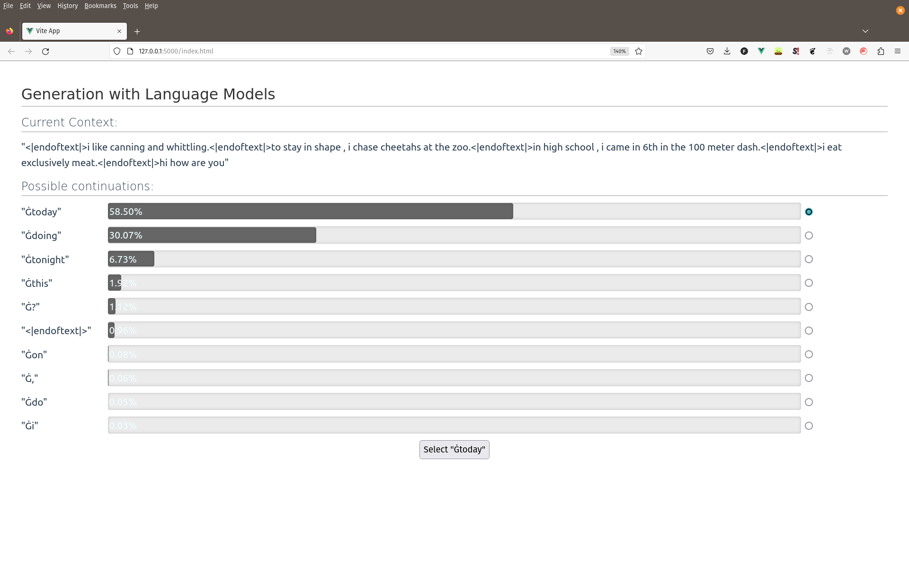

# Conditional Language Model Generation Visualization
- when evaluating language models it is often pain to see what is generated and why
- this little package is a `vue.js` frontend together with `flask` backend and it is designed to easily show some interesting visualizations on conditional generation models

## Installation
- right now only installation right from the git is supported, however I plan to deploy the package also to PyPi
- `pip install git+https://github.com/gortibaldik/visualize_llm_generation#egg=llm_generation_server`

## Usage
The library is composed of two parts:
1. Server - `llm_generation_server.server.Server`
2. Components - `llm_generation_server.*_component.[a-zA-Z]*Component(ABC)`

The server can be used as is while the components must be extended. The inheritors of base components should initialize the main parts without which
it is impossible to run anything, e.g. for the `NextTokenPredictionComponent`
one must override `initialize_vocab`, `append_to_context`, `get_next_token_predictions`. The `examples_py` as well as the next section show several rather unuseful examples how to override these methods.

### Example

```python
from llm_generation_server.server import Server
from llm_generation_server.next_token_prediction_component import NextTokenPredictionComponent
import requests
import random
import numpy as np

# override of NextTokenPredictionComponent
#
# downloads a word dict from mit wordlist and returns
# random 10 words with random distribution over them
class ExampleNextTokenPredictionComponent(NextTokenPredictionComponent):
    def initialize_vocab(self):
        word_site = "https://www.mit.edu/~ecprice/wordlist.10000"
        response = requests.get(word_site)
        self.word_dict = response.content.splitlines()
        self.word_dict = [x.decode('utf-8') for x in self.word_dict]
        self.ix_arr = list(range(len(self.word_dict)))
    
    def append_to_context(self, context: str, post_token: str):
        context = context + " " + post_token
        return context
    
    def format_context(self, context: str):
        return "<br>".join(context.split())

    def get_next_token_predictions(self, context: str):
        K = self.n_largest_tokens_to_return * 3
        twenty_ixes = random.choices(self.ix_arr, k=K)
        twenty_probs = [random.random() for _ in range(K)]
        twenty_probs = np.exp(twenty_probs)
        twenty_probs /= np.sum(twenty_probs)
        probs = np.zeros((len(self.word_dict, )))
        probs[twenty_ixes] = twenty_probs
        return self.create_continuations(probs)

# create the component
next_token_component = ExampleNextTokenPredictionComponent()
next_token_component.initialize_context("Some initial context")
next_token_component.initialize_vocab()

# create server, inject components into it
server = Server(__name__, [next_token_component])

# start the server
server.run()
```


