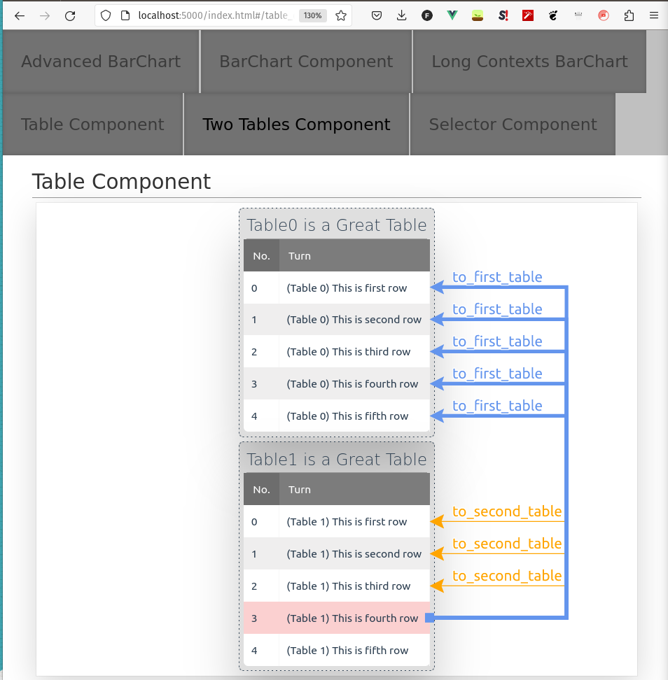
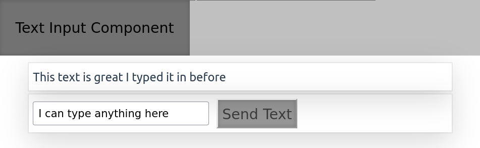

# Modules Example

In this example you can learn about how do individual elements look and how they can be composed to form a more complex components.

## Run command

```sh
flask --app examples_py.example_modules.app run
```

## Implemented Elements

I wrote this library to help me visualize the output distributions of various models I implemented during my master's thesis. Therefore I implemented only few basic elements for ML purposes.

In the following paragraphs I'll explain how to create configuration selectors, tables, bar-charts and other elements.
- [Selectors](#configuration-selection)
    - [Min-max](#minmax-subelement)
    - [Choices](#choices-subelement)
    - [Checkbox](#checkbox-subelement)
    - [Button](#button-element) 
- [Table](#table-element)
- [BarChart](#barchart-element)   
- [Text Input](#text-input-element)
  
I'll use the following server: (You'll see the implementation of each of yet unknown components)

<!-- MARKDOWN-AUTO-DOCS:START (CODE:src=./app.py&header=# ./app.py)-->
<!-- The below code snippet is automatically added from ./app.py -->
```py
# ./app.py
import flask

from visuallm.server import Server

from .components.bar_chart_component_advanced import BarChartComponentAdvanced
from .components.bar_chart_component_simple import BarChartComponentSimple
from .components.selector_component import SelectorComponent
from .components.table_component import TableComponent
from .components.text_input_component import TextInputComponent
from .components.two_tables_component import TwoTablesComponent


def create_app() -> flask.Flask:
    flask_app = Server(
        __name__,
        [
            BarChartComponentAdvanced(),
            BarChartComponentSimple(),
            BarChartComponentSimple(long_contexts=True, title="Long Contexts BarChart"),
            TableComponent(),
            TwoTablesComponent(),
            SelectorComponent(),
            TextInputComponent(),
        ],
    )
    app = flask_app.app
    return app


if __name__ == "__main__":
    app = create_app()
```
<!-- MARKDOWN-AUTO-DOCS:END-->

### Configuration Selection

Several different kinds of configuration specifier, together with one button element. The button element allows backend communication and by itself it does nothing. However you can specify subelements, for which the button element will provide communication updates. For the example below, the following imports will be used:

<!-- MARKDOWN-AUTO-DOCS:START (CODE:src=./components/selector_component.py&lines=1-11&header=# ./components/selector_component.py lines 1-11)-->
<!-- The below code snippet is automatically added from ./components/selector_component.py -->
```py
# ./components/selector_component.py lines 1-11
import time
from typing import Optional

from visuallm.component_base import ComponentBase
from visuallm.elements import MainHeadingElement, PlainTextElement
from visuallm.elements.selector_elements import (
    ButtonElement,
    CheckBoxSubElement,
    ChoicesSubElement,
    MinMaxSubElement,
)
```
<!-- MARKDOWN-AUTO-DOCS:END-->

#### MinMax SubElement

Input element for setting integer in a range.

<!-- MARKDOWN-AUTO-DOCS:START (CODE:src=./components/selector_component.py&lines=18-20&header=# ./components/selector_component.py lines 18-20)-->
<!-- The below code snippet is automatically added from ./components/selector_component.py -->
```py
# ./components/selector_component.py lines 18-20
        self.number_selector_element = MinMaxSubElement(
            sample_min=0, sample_max=10, text="Select Number:"
        )
```
<!-- MARKDOWN-AUTO-DOCS:END-->

#### Choices SubElement

Input element for choosing between several choices.

<!-- MARKDOWN-AUTO-DOCS:START (CODE:src=./components/selector_component.py&lines=21-23&header=# ./components/selector_component.py lines 21-23)-->
<!-- The below code snippet is automatically added from ./components/selector_component.py -->
```py
# ./components/selector_component.py lines 21-23
        self.choices_element = ChoicesSubElement(
            choices=["super", "magnificent", "incredible"], text="This library is:"
        )
```
<!-- MARKDOWN-AUTO-DOCS:END-->

#### Checkbox SubElement

Simple checkbox input element.

<!-- MARKDOWN-AUTO-DOCS:START (CODE:src=./components/selector_component.py&lines=24-24&header=# ./components/selector_component.py lines 24)-->
<!-- The below code snippet is automatically added from ./components/selector_component.py -->
```py
# ./components/selector_component.py lines 24
        self.checkbox_element = CheckBoxSubElement(text="Have you slept?:")
```
<!-- MARKDOWN-AUTO-DOCS:END-->

#### Button Element

This is an element that should encapsulate all the other configuration selection elements. It needs a callback method that will be called when the button is pressed and we provide `ButtonElement.default_select_callback()` which handles processing all the changes sent from the frontend and attributing them to `subelement.selected` properties of subelements.

<!-- MARKDOWN-AUTO-DOCS:START (CODE:src=./components/selector_component.py&lines=30-55&header=# ./components/selector_component.py lines 30-55)-->
<!-- The below code snippet is automatically added from ./components/selector_component.py -->
```py
# ./components/selector_component.py lines 30-55
        self.button_element = ButtonElement(
            processing_callback=self.on_button_clicked,
            subelements=[
                self.number_selector_element,
                self.choices_element,
                self.checkbox_element,
            ],
        )
        self.add_element(MainHeadingElement(content="Selector Component"))
        self.add_elements([self.button_element, self.text_element])

    def on_button_clicked(self):
        n = self.number_selector_element.selected
        c = self.choices_element.selected
        message = (
            "I say it as a well-relaxed man!"
            if self.checkbox_element.selected
            else "Don't take me seriously."
        )
        any_updated = (
            self.number_selector_element.updated
            or self.choices_element.updated
            or self.checkbox_element.updated
        )
        self.set_text_element(c, n, message, any_updated)
        time.sleep(n)
```
<!-- MARKDOWN-AUTO-DOCS:END-->


### Table Element

This element can show several tables on the frontend together with a special feature, links between rows of the tables. They may connect different rows of different tables and display some value above links.
The below example displays, how to generate one table on the frontend with the links pointing from each row to all the upwards rows as displayed on the image.

<!-- MARKDOWN-AUTO-DOCS:START (CODE:src=./components/table_component.py&header=# ./components/table_component.py)-->
<!-- The below code snippet is automatically added from ./components/table_component.py -->
```py
# ./components/table_component.py
from visuallm.component_base import ComponentBase
from visuallm.elements.plain_text_element import MainHeadingElement
from visuallm.elements.table_element import LinkBetweenRows, TableElement


class TableComponent(ComponentBase):
    def __init__(self):
        super().__init__(name="table_component", title="Table Component")
        self._initialize_table_element()
        self.add_element(MainHeadingElement(content="Table Component"))
        self.add_element(self.table_element)

    def _initialize_table_element(self):
        """Create a simple table with links pointing to all the rows upwards"""
        self.table_element = TableElement()

        # create a table with headers
        headers = ["No.", "Turn"]
        rows = [
            [i, x]
            for i, x in enumerate(
                [
                    "This is first row",
                    "This is second row",
                    "This is third row",
                    "This is fourth row",
                    "This is fifth row",
                ]
            )
        ]
        self.table_element.clear()
        TABLE_NAME = "Table1 is a Great Table"
        self.table_element.add_table(TABLE_NAME, headers, rows)

        # add links pointing to all the rows upwards
        for j in range(len(rows) - 1, 0, -1):
            for i in range(j):
                self.table_element.add_link_between_rows(
                    LinkBetweenRows(TABLE_NAME, j, TABLE_NAME, i, Label="some value")
                )
```
<!-- MARKDOWN-AUTO-DOCS:END-->


### Table Element (Advanced)

Let's look at an advanced example of table element, where we create two tables and add links which connect multiple tables. I will only show the important snippets of code.

Firstly, we will import `Colors` enumeration to color links to different tables with different colors.

<!-- MARKDOWN-AUTO-DOCS:START (CODE:src=./components/two_tables_component.py&header=# ./components/two_tables_component.py lines 1-3&lines=1-3)-->
<!-- The below code snippet is automatically added from ./components/two_tables_component.py -->
```py
# ./components/two_tables_component.py lines 1-3
from visuallm.component_base import ComponentBase
from visuallm.elements import MainHeadingElement
from visuallm.elements.table_element import Colors, LinkBetweenRows, TableElement
```
<!-- MARKDOWN-AUTO-DOCS:END-->

Secondly, we will create the links in such a way, that links going within the same table will be colored orange (the default color), while the links going to the other table will be colored light blue. Also links within one table will be thin, while links to the other table will be thick (`Importance` parameter).

<!-- MARKDOWN-AUTO-DOCS:START (CODE:src=./components/two_tables_component.py&header=# ./components/two_tables_component.py lines 43-88&lines=43-88)-->
<!-- The below code snippet is automatically added from ./components/two_tables_component.py -->
```py
# ./components/two_tables_component.py lines 43-88
        # add links pointing from the rows of the first table to all the rows
        # of the first table upwards
        for j in range(len(rows[0]) - 1, 0, -1):
            for i in range(j):
                self.table_element.add_link_between_rows(
                    LinkBetweenRows(
                        TABLE_NAMES[0],
                        j,
                        TABLE_NAMES[0],
                        i,
                        Importance=1,
                        Label="to_this_table",
                    )
                )

        # add links pointing from each row of the second table to all the rows
        # of the first table and also to all the rows of the second table
        # upwards
        for j in range(len(rows[1]) - 1, 0, -1):
            # links going from the row j of the second table to all the upper
            # rows in the second table
            for i in range(j):
                self.table_element.add_link_between_rows(
                    LinkBetweenRows(
                        TABLE_NAMES[1],
                        j,
                        TABLE_NAMES[1],
                        i,
                        Importance=1,
                        Label="to_second_table",
                    )
                )

            # links going from the row j to all the rows in the first table
            for i in range(len(rows[0])):
                self.table_element.add_link_between_rows(
                    LinkBetweenRows(
                        TABLE_NAMES[1],
                        j,
                        TABLE_NAMES[0],
                        i,
                        Label="to_first_table",
                        Importance=4,
                        Color=Colors.LIGHT_BLUE,
                    )
                )
```
<!-- MARKDOWN-AUTO-DOCS:END-->



### BarChart Element

This element displays a modular horizontal barchart. It has several configuration options, so I'll try to show-case several of them.

The default bar-chart displays a horizontal selectable bar-chart. It is useful for displaying softmax distributions for the next token prediction. I implemented it in such a way that it is selectable, hence you can navigate the whole process of sequence generation in the same way as the automatic generation would do. Hence this component also implements frontend-backend communication and you can supply an `endpoint_callback` to it.

<!-- MARKDOWN-AUTO-DOCS:START (CODE:src=./components/bar_chart_component_simple.py&lines=1-44&header=# ./components/bar_chart_component_simple.py lines 1-44)-->
<!-- The below code snippet is automatically added from ./components/bar_chart_component_simple.py -->
```py
# ./components/bar_chart_component_simple.py lines 1-44
import heapq
import math
import random

import requests

from visuallm.component_base import ComponentBase
from visuallm.elements.barchart_element import BarChartElement, PieceInfo
from visuallm.elements.plain_text_element import PlainTextElement


class BarChartComponentSimple(ComponentBase):
    def __init__(self, long_contexts: bool = False, title="BarChart Component"):
        super().__init__(name="barchart_component", title=title)
        self.word_vocab, self.word_ids = download_word_vocabulary()
        self.barchart_element = BarChartElement(
            processing_callback=self.barchart_callback, long_contexts=long_contexts
        )
        self.text_element = PlainTextElement()
        self.add_elements([self.barchart_element, self.text_element])
        self.update_barchart_component()

    def update_barchart_component(self):
        probs = sample_ten_words(self.word_ids)
        K = 10
        ten_largest_probs = heapq.nlargest(K, zip(*zip(*probs), self.word_vocab))

        piece_infos = []
        for i in range(K):
            piece_infos.append(
                PieceInfo(
                    pieceTitle=ten_largest_probs[i][1],
                    barHeights=[ten_largest_probs[i][0]],
                    barAnnotations=[f"{ten_largest_probs[i][0]:.2f}%"],
                    barNames=[""],
                )
            )

        self.barchart_element.set_piece_infos(piece_infos)

    def barchart_callback(self):
        s = self.barchart_element.selected
        self.text_element.content = f"Last selected: {s}"
        self.update_barchart_component()
```
<!-- MARKDOWN-AUTO-DOCS:END-->


When you set `long_contexts` option to true, the bar charts will be below the bar titles.


### BarChart Element (Advanced)

This example will display the advanced possibilities I use when e.g. comparing different generation candidates provided by the model.

When I want to compare several candidates, I can display multi-bar-chart, e.g. add multiple bars with different heights, different annotations, each describing one particular quality of the generated sample.

<!-- MARKDOWN-AUTO-DOCS:START (CODE:src=./components/bar_chart_component_advanced.py&lines=1-50&header=# ./components/bar_chart_component_advanced.py lines 1-50)-->
<!-- The below code snippet is automatically added from ./components/bar_chart_component_advanced.py -->
```py
# ./components/bar_chart_component_advanced.py lines 1-50
import math
import random
from typing import List

from visuallm.component_base import ComponentBase
from visuallm.elements.barchart_element import BarChartElement, PieceInfo


class BarChartComponentAdvanced(ComponentBase):
    def __init__(self):
        super().__init__(name="advanced_barchart", title="Advanced BarChart")
        self._names_of_bars = ["Quality", "Perplexity", "Consistency", "Fluency"]
        self.barchart_element = BarChartElement(long_contexts=True)
        self.add_element(self.barchart_element)
        self.init_barchart_element()

    def init_barchart_element(self):
        distributions: List[List[float]] = []
        size_of_distro = 5
        for i in range(len(self._names_of_bars)):
            distributions.append(make_some_distribution(size_of_distro))

        # names of the whole piece with multiple bars
        piece_names = [
            "Use the portable output format.",
            "Give very verbose output about all the program knows about.",
            "Terminate option list.",
            "You should document the library so that the potential user "
            + "could make sense of it.",
            "This will indicate the state of the repository that should be "
            + "evaluated.",
        ]

        piece_infos: List[PieceInfo] = []
        for i in range(size_of_distro):
            # heights of individual bars in the piece
            bar_heights = [distro[i] for distro in distributions]

            # annotations inside individual bars in the piece
            bar_annotations = [f"{h:.2f}" for h in bar_heights]
            piece_infos.append(
                PieceInfo(
                    pieceTitle=piece_names[i],
                    barHeights=bar_heights,
                    barAnnotations=bar_annotations,
                    barNames=self._names_of_bars,
                )
            )

        self.barchart_element.set_piece_infos(piece_infos)
```
<!-- MARKDOWN-AUTO-DOCS:END-->


### Text Input Element

Allows chat-like interfaces with the models.

<!-- MARKDOWN-AUTO-DOCS:START (CODE:src=./components/text_input_component.py&header=# ./components/text_input_component.py)-->
<!-- The below code snippet is automatically added from ./components/text_input_component.py -->
```py
# ./components/text_input_component.py
from visuallm.component_base import ComponentBase
from visuallm.elements import (
    ButtonElement,
    HeadingElement,
    MainHeadingElement,
    PlainTextElement,
    TextInputElement,
)


class TextInputComponent(ComponentBase):
    def __init__(self):
        super().__init__(name="text_input_component", title="Text Input Component")
        self.add_elements(
            [
                MainHeadingElement(content="Text Input Component"),
                HeadingElement("Text Input Blanks After Send"),
                PlainTextElement(
                    """`Send Text` button fills in the text in the element below. The
                    textarea is blanked out. `Fill in default text` fills the element
                    with some default text."""
                ),
                HeadingElement("Sent Text:", heading_level=4),
            ]
        )
        self.text_display_element_1 = PlainTextElement(
            content="Nothing has been typed in yet"
        )
        self.text_input_blanked_element = TextInputElement(
            processing_callback=self.on_text_sent_blanked,
            button_text="Send Text",
            blank_text_after_send=True,
        )
        self.add_elements(
            [
                self.text_display_element_1,
                self.text_input_blanked_element,
                ButtonElement(
                    processing_callback=self.on_set_default_text_button_pressed,
                    button_text="Fill in default text",
                ),
                HeadingElement("Text Input Stays After Send"),
                PlainTextElement(
                    """`Send Text` button fills in the text in the element below. The
                    textarea stays the same, so the user can edit the text that was
                    previously sent."""
                ),
                HeadingElement("Sent Text:", heading_level=4),
            ]
        )
        self.text_display_element_2 = PlainTextElement(
            content="Nothing has been typed in yet"
        )
        self.text_input_stay_element = TextInputElement(
            processing_callback=self.on_text_sent_stays,
            button_text="Send Text",
            blank_text_after_send=False,
        )
        self.add_elements([self.text_display_element_2, self.text_input_stay_element])

    def on_text_sent_blanked(self):
        self.text_display_element_1.content = self.text_input_blanked_element.text_input

    def on_text_sent_stays(self):
        self.text_display_element_2.content = self.text_input_stay_element.text_input

    def on_set_default_text_button_pressed(self):
        self.text_input_blanked_element.predefined_text_input = (
            "This is the default text!"
        )
```
<!-- MARKDOWN-AUTO-DOCS:END-->


